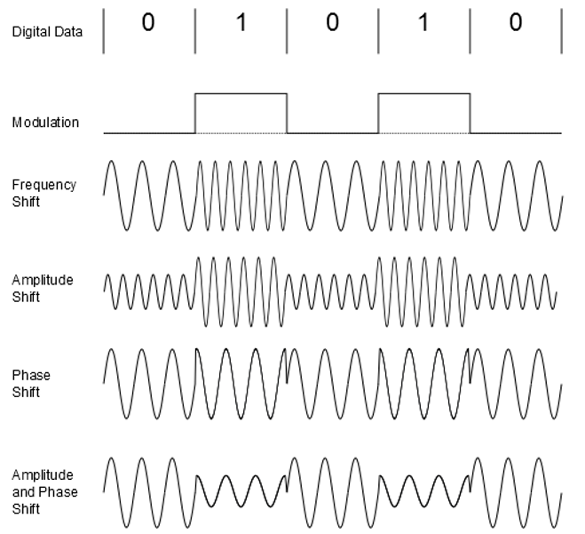
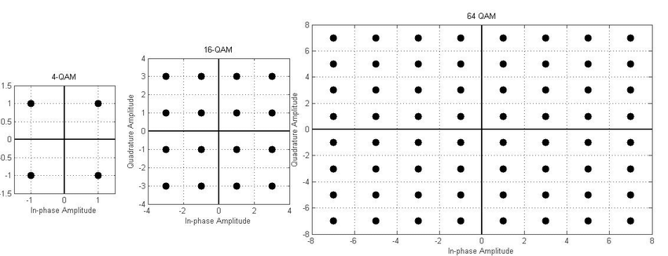
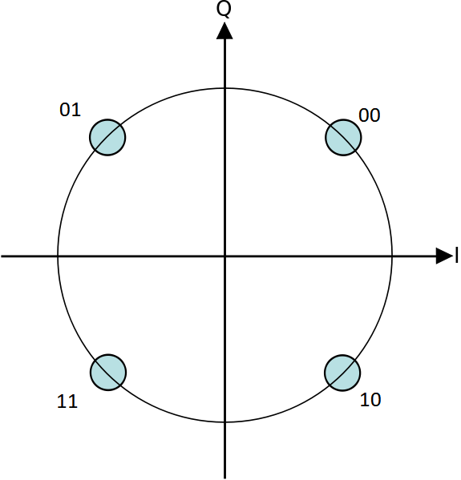
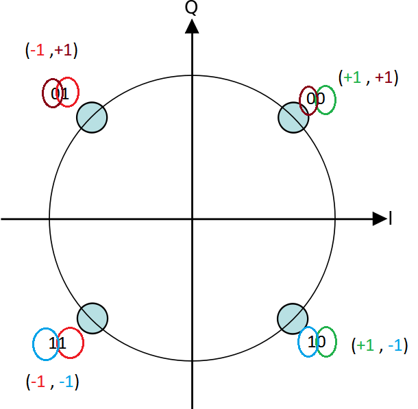
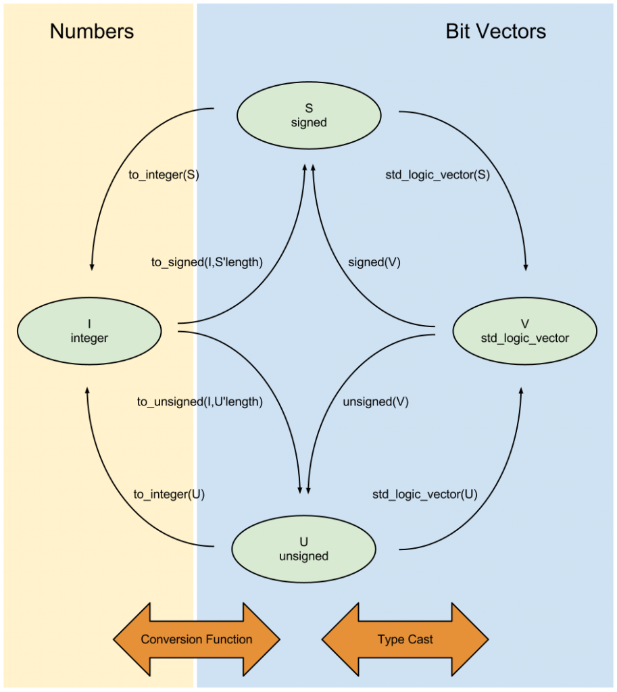
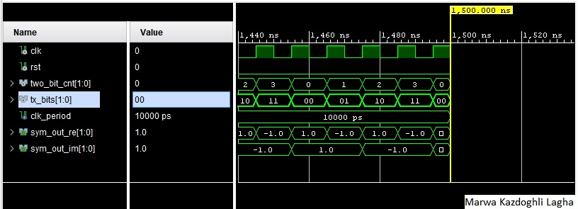
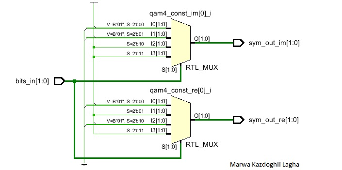
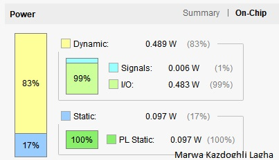
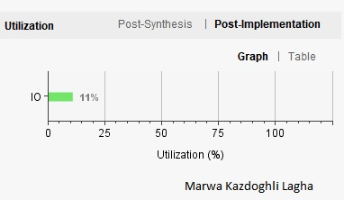
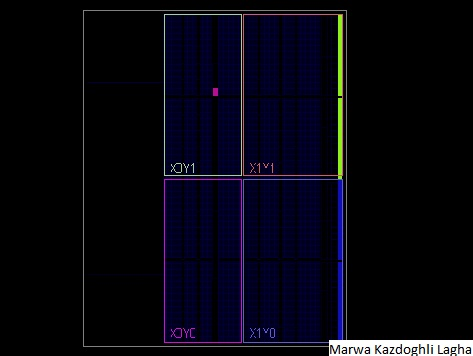

# VHDL implementation of 4-QAM Modulation

Quadrature Amplitude modulation is an effective solution to increasing the bandwidth efficiency with a lesser need for signal 
power is to combine amplitude and phase modulation. The aim of this project is to design a digital circuit that creates a Quadrature Amplitude Modulation (QAM) of order 4.

The final project report contains: 
* General introduction 
* Project steps
* Conclusions
 
 ## General introduction
 QAM stands for Quadrature Amplitude modulation and is the most common modulation used by modern digital radios to encode information in Radio-Frequency waves.
The RF waves have three main properties that we can control to encode information about them:
1. Amplitude 
2. Frequency
3. Phase

Digital communication systems work with ones and zeros that are easy to code. With amplitude modulation, a simple on/off switch is sufficient to encode 1 and 0.
With frequency modulation, signals with two different frequencies do the job, and with phase modulation, it is shifting the signal by 180 degrees.
The QAM is a combination of amplitude and phase modulations as depicted in figure below.

Note that the length of the symbol determines the depth of QAM modulation and the maximum number of symbols. The symbols can be mapped into a so-called
constellation diagram. The 4-QAM has 4 possible symbols with 2 bits of information per symbol. The 16-QAM has 16 symbols with 4 information bits per symbol.
64-QAM has 64 symbols and so on.

To prevent spurious output from electromechanical switches and to facilitate error correction in digital communications, Gray codes is used. It consists in ordering
the binary numerical system such that two successive values differ in only one bit (binary digit).
For example, the representation of the decimal value "1" in binary would normally be "001" and "2" would be "010". 
In Gray code, these values are represented as "001" and "011". That way, incrementing a value from 1 to 2 requires only one bit to change, instead of two.

In what follow, we will focus on 4-QAM (or Quadrature phase shift keying QPSK) modulation with Gray coding. In this case, the constellation diagram for Gray-coded 4-QAM is shown in figure bellow.

 

 ## Project steps
 
 The project steps are detailed in the below design flow
 
 
 
 
 The proposed technical levels are:

1. QPSK modulation VHDL & testbench implementation
2. Evaluate the behavioral simulation
3. Synthesis and hardware implementation of the project

### 1. QPSK modulation VHDL & testbench implementation

In the VHDL implementation, we use signed fixed-point numbers with 2 bits for the integer part and 0 fractional bits. With this choice, it is possible
to represent form -2 to +1. Also, bit to symbol mapping use this trick for 4-QAM modulation: 
whenever the least significant bit is 0, we have +1 in the real part of the complex symbol and whenever the LSB bit is 1, the imaginary part of the symbol is mapped to -1.
For the most signficant bits, when we have a bit of 0, the real part of the symbol is +1 and when the bit is 1 we have -1 in the imaginary part of the symbol.

~~~
Constelltaion

Input bits  | Output symbols
----------------------------
            | Re       Im
----------------------------
---(00)     | (+1,     +1)
----------------------------
---(01)     | (-1,     +1)
----------------------------
---(10)     | (+1,     -1)
----------------------------
---(11)     | (-1,     -1)
----------------------------
~~~

The illustration of such mapping is explained in the Figure below.

 

Also, to map between numbers and bit vectors, we use the conversion function and type casts as depited in the Figure below.

 

The test-bench is also implemented to evaluate the effectivness of the VHDL code.
 Next, we will evaluate the presented VHDL implementation.

### 2. Evaluate the behavioral simulation

We run the behavioral simulation using Vivado HLS software. The resulted output is depicted in the Figure below.

 

The output from the simulation contains the expected values of 4-QAM modulations.

### 3. Synthesis and hardware implementation of the project

The hardware implementation of the design was carried out using Vivado software by Xilinx. The targed will be the Zynq borad.
The typical flow of hardware implementation implies 

#### 3.1. RTL analysis
#### 3.2. Synthesis and finally the implementation

#### 3.1. RTL view

Figure below shows the RTL view of the 4-QAM modulator.
 

#### 3.2. Synthesis and finally the implementation
   1. Power 
The on-chip power are basically from the I/O peripherials (99%) and in a second part from the inner signals (1%).
 

   2. Utilization report
The used resource us the I/O as the circuit has 2 bits input and a 2 bits output.

 

   3. Device 
  The pink area shows the used resources of a FPGA in device view.

 ## Conclusions

The proposed project meets the 4-QAM modulation process requirements.
Further Higher modulation format could also be implemented.

Thanks for the lecture.
Marwa.

